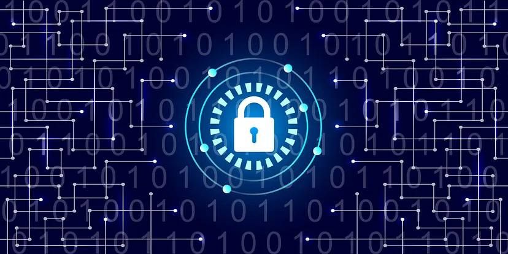

# PHP Obfuscator

[](./LICENSE)

## Support The Project

Your support is greatly appreciated and will help ensure the project's continued development and improvement. Thank you for being a part of the community!

[](https://bmc.link/mnestorov) [](https://www.paypal.me/mnestorov)

## Overview

PHP Obfuscator is a command-line tool build with Python to obfuscate PHP source code files using [YAK Pro](https://github.com/pk-fr/yakpro-po) and [PHP-Parser](https://github.com/nikic/PHP-Parser/tree/4.x/) php libraries. 

The tool aims to protect the intellectual property of your PHP project by making it more difficult for others to understand or reverse-engineer your code. 

The tool can be used to obfuscate **single files**, **multiple files**, or an **entire project directory**.

## Example

### Before

**_app/Users.php_**

```php
<?php

namespace App;

use Illuminate\Contracts\Auth\MustVerifyEmail;
use Illuminate\Foundation\Auth\User as Authenticatable;
use Illuminate\Notifications\Notifiable;

class User extends Authenticatable
{
    use Notifiable;

    /**
     * The attributes that are mass assignable.
     *
     * @var array
     */
    protected $fillable = [
        'username', 'email', 'password', 'background_color', 'text_color'
    ];

    /**
     * The attributes that should be hidden for arrays.
     *
     * @var array
     */
    protected $hidden = [
        'password', 'remember_token',
    ];

    public function links()
    {
        return $this->hasMany(Link::class);
    }

    public function visits()
    {
        return $this->hasManyThrough(Visit::class, Link::class);
    }

    public function getRouteKeyName() {
        return 'username';
    }

}

```

### After

**_app/Users.php_**

```php
<?php
 namespace App; use Illuminate\Contracts\Auth\MustVerifyEmail; use Illuminate\Foundation\Auth\User as Authenticatable; use Illuminate\Notifications\Notifiable; class User extends Authenticatable { use Notifiable; protected $fillable = array("\165\163\145\162\x6e\141\155\x65", "\x65\x6d\x61\x69\x6c", "\x70\x61\163\x73\167\157\162\x64", "\x62\x61\143\x6b\147\x72\x6f\x75\156\144\137\x63\157\154\157\x72", "\164\145\x78\x74\x5f\143\157\x6c\x6f\162"); protected $hidden = array("\160\141\163\x73\167\x6f\x72\144", "\x72\145\x6d\145\155\142\x65\x72\137\164\157\x6b\145\156"); public function links() { return $this->hasMany(Link::class); } public function visits() { return $this->hasManyThrough(Visit::class, Link::class); } public function getRouteKeyName() { return "\x75\163\145\162\x6e\x61\x6d\145"; } }
```

## Requirements

- Python 3.6+
- PHP-Parser (PHP library)
- YAK Pro - Php Obfuscator (PHP library)

## Installation

1. Clone the repository

```
git clone https://github.com/your-github-repo/php-obfuscator.git
```

2. Change to the project directory

```
cd php-obfuscator
```

3. Install YAK Pro - Php Obfuscator

You need to install this in to the project directory **_php-obfuscator_**

```
git clone https://github.com/pk-fr/yakpro-po.git
```

After that, you need to configure the package from `yakpro-po.cnf` in to the **_php-obfuscator > yakpro-po_** folder.

**Recommended settings for the YAK Pro configuration:**

```php
// Allowed modes are: 'PREFER_PHP7', 'PREFER_PHP5', 'ONLY_PHP7', 'ONLY_PHP5'
$conf->parser_mode = 'PREFER_PHP7'; 

$conf->obfuscate_constant_name = false;         
$conf->obfuscate_variable_name = false;        
$conf->obfuscate_function_name = false;        
$conf->obfuscate_class_name = false;         
$conf->obfuscate_interface_name = false;         
$conf->obfuscate_trait_name = false;         
$conf->obfuscate_class_constant_name = false;        
$conf->obfuscate_property_name = false;        
$conf->obfuscate_method_name = false;         
$conf->obfuscate_namespace_name = false;         
$conf->obfuscate_label_name = false;    

// User comment to insert inside each obfuscated file
$conf->user_comment = false;         
```     

4. Install PHP-Parser

You need to install this in to the **yakpro-po** directory in to the project directory **_php-obfuscator > yakpro-po_**

```
git clone https://github.com/nikic/PHP-Parser.git
```
5. Install the required Python packages

**From the project directory, you need to run this command:**

```
pip install -r requirements.txt
```

## Usage

1. Ensure you are in the project directory.
2. Run the script

```
python main.py
```

or

```
bash start.sh
```

**Note:** Don't forget to change the path to the script in to the `start.sh` bash file.

3. Follow the prompts to configure the obfuscation settings, including:
    - Mode (single file, multiple files, or entire project directory)
    - Output directory path
    - File or directory paths to exclude
    - Whether to create backups of original PHP files

4. After the obfuscation process is completed, you can find the obfuscated files in the specified output directory.

## Used Libraries

### Python

- **os**, **sys**, **shutil**, and **re** - standard Python libraries for working with the file system and regular expressions
- **logging** - standard Python library for logging
- **concurrent.futures** - standard Python library for parallel processing
- **tqdm** - external library for progress bars

### PHP

- [YAK Pro - a PHP library for obfuscating PHP code](https://github.com/pk-fr/yakpro-po)
- [PHP-Parser - a PHP library to parse and traverse PHP code](https://github.com/nikic/PHP-Parser/tree/4.x/)

## Troubleshooting

If you encounter issues after obfuscating your PHP project, you may need to revert your files to the original (non-obfuscated) versions and reevaluate your obfuscation strategy. Always keep backups of your original code before applying obfuscation, as it can be difficult or impossible to reverse the process and recover the original code.

## TODOs

- [x] **_Custom obfuscation options:_** ~~Allow users to choose from different obfuscation options (e.g., obfuscating variable names, function names, or class names) or combine multiple options.~~
- **_File filters:_** Add filters to include or exclude specific files based on their names or extensions.
- **_Preserve original file structure:_** When obfuscating an entire project directory, recreate the original directory structure in the output folder, maintaining the same hierarchy.
- **_Command-line arguments:_** Implement command-line argument parsing to allow users to run the script with different configurations without manually editing the code.

## Support The Project

If you find this script helpful and would like to support its development and maintenance, please consider the following options:

- **_Star the repository_**: If you're using this script from a GitHub repository, please give the project a star on GitHub. This helps others discover the project and shows your appreciation for the work done.

- **_Share your feedback_**: Your feedback, suggestions, and feature requests are invaluable to the project's growth. Please open issues on the GitHub repository or contact the author directly to provide your input.

- **_Contribute_**: You can contribute to the project by submitting pull requests with bug fixes, improvements, or new features. Make sure to follow the project's coding style and guidelines when making changes.

- **_Spread the word_**: Share the project with your friends, colleagues, and social media networks to help others benefit from the script as well.

- **_Donate_**: Show your appreciation with a small donation. Your support will help me maintain and enhance the script. Every little bit helps, and your donation will make a big difference in my ability to keep this project alive and thriving.

[](https://bmc.link/mnestorov) [](https://www.paypal.me/mnestorov)

Your support is greatly appreciated and will help ensure the project's continued development and improvement. Thank you for being a part of the community!

---

## License

This project is released under the MIT License.
